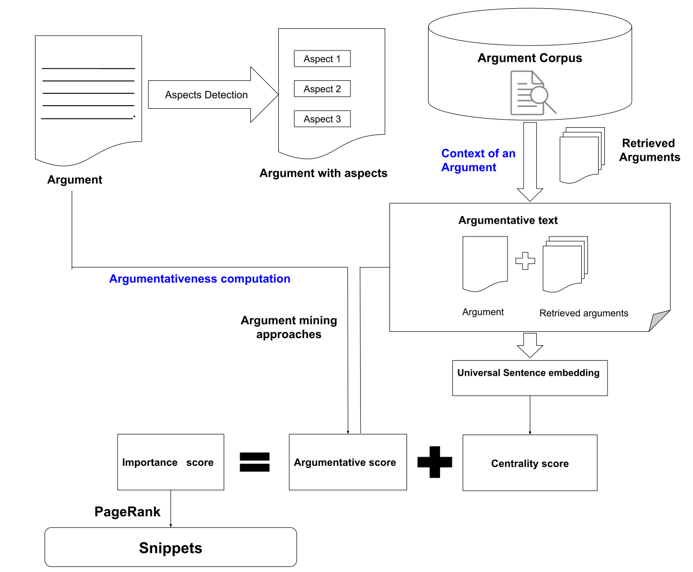

# Snippet Generation for Arguments

## Master Thesis:  Modelling the context and argumentativeness of sentences in argument Snippet Generation 

The thesis work is an extended version of the approach of Alshomary et al. for the snippet generation for arguments.

    @InProceedings{elbaff:2020,
      author =              {Milad Alshomary, Nick Düsterhus, Henning Wachstmuth},
      booktitle =           {The 43rd International ACM SIGIR Conference on Research and Development in Information Retrieval},
      month =               July,
      publisher =           {SIGIR},
      title =               {{Extractive Snippet Generation for Arguments}},
      year =                2020

### Table of Contents

- [Project Overview](#project-overview)
- [Project Setup](#how-to-use)
- [References](#references)
- [License](#license)

## Project Overview
### Task Definition
 **Snippet Generation for the arguments.** The task focuses on automatically generating a snippet for an argument search. Snippets are generated from the argument and contain two sentences extracted from an argument. The definition provided by Alshomary et al. for an [extractive snippet generation for arguments ](https://dl.acm.org/doi/10.1145/3397271.3401186) is followed for the generation of a snippet for an argument. (Alshomary et al., 2020) defined the snippet generation task as :

` "Given a natural language argument, generate a two-sentence snippet that best repre-sents the argument’s main claim and main reason."`
 
## System Architecture
The figure shows the architecture of the extended version of snippet generation (Alshomary et al., 2020). The figure expresses the two main tasks performed  in this snippet generation project:
1. Argument context modelling 
2. Argumentativeness computation

The centrality score is calculated from sentences of an argumentative text. An argumentative text contains a given argument and retrieved arguments. Aspects detection is performed on arguments to retrieve arguments from corpora. Retrieved arguments are added to the context of an argument. The argumentativeness score for a sentence in a given argument is computed using argumentation mining approaches. As shown in the figure, the importance score is the sum of the centrality score and argumentative score. Importance score for sentences for all sentences in the arguments using the variant of  PageRank algorithm [Page et al., 1999](). All sentences of arguments are ranked using the importance score, and the two most ranked sentences in their original ordering are selected as the snippet of an argument.

## Project Setup
### Installation
The Code is written in Python 3.7. If you are using a lower version of Python you upgrade the version using the pip package, ensuring you have the latest version of pip. 

To install the required packages and libraries using pipenv , run this command in the project directory after cloning the repository:

`pip install -r requirements.txt`

To install the required packages and libraries using condaenv , run the command below in the project directory after cloning the repository. This step creates an environment from an environment.yml file

`conda env create -f environment.yml`

## References

Milad Alshomary, Nick Düsterhus, and Henning Wachsmuth. 2020. Extractive snippet generation for arguments. In Proceedings of the 43rd International ACM SIGIR Conference on Research and Development in Information Retrieval. ACM,

Yamen Ajjour, Henning Wachsmuth, Johannes Kiesel, Martin Potthast, Matthias Hagen, and Benno
Stein. 2019b. Data Acquisition for Argument Search: The args.me corpus. In 42nd German Conference on Artificial Intelligence (KI 2019), pages 48–59, Berlin Heidelberg New York. Springer.

Lawrence Page, Sergey Brin, Rajeev Motwani, and Terry Winograd. 1999. The pagerank citation ranking:Bringing order to the web. Technical report, Stanford InfoLab.

Yamen Ajjour, Henning Wachsmuth, Dora Kiesel, Patrick Riehmann, Fan Fan, Giuliano Castiglia, Rosemary Adejoh, Bernd Fröhlich, and Benno Stein. 2018. Visualization of the topic space of argument search results in args. me. In Proceedings of the 2018 Conference on Empirical Methods in Natural Language Processing: System Demonstrations, pages 60–65.

Tuhin Chakrabarty, Christopher Hidey, and Kathleen McKeown. 2019. Imho fine-tuning improves claim detection. arXiv preprint arXiv:1905.07000.

https://huggingface.co/chkla/roberta-argument

